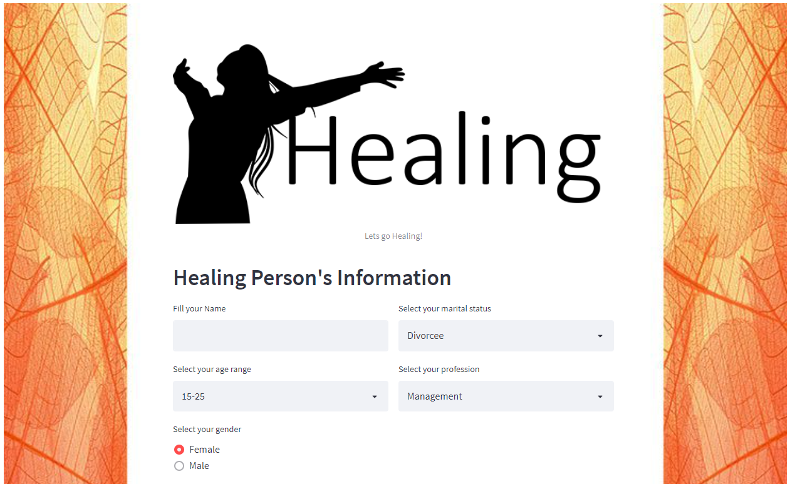
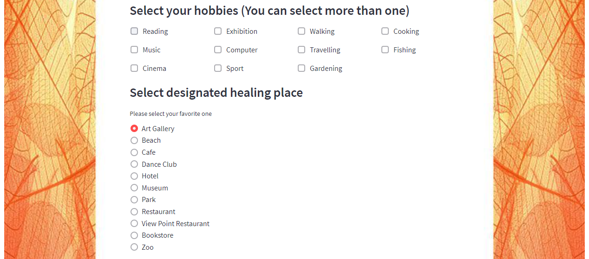
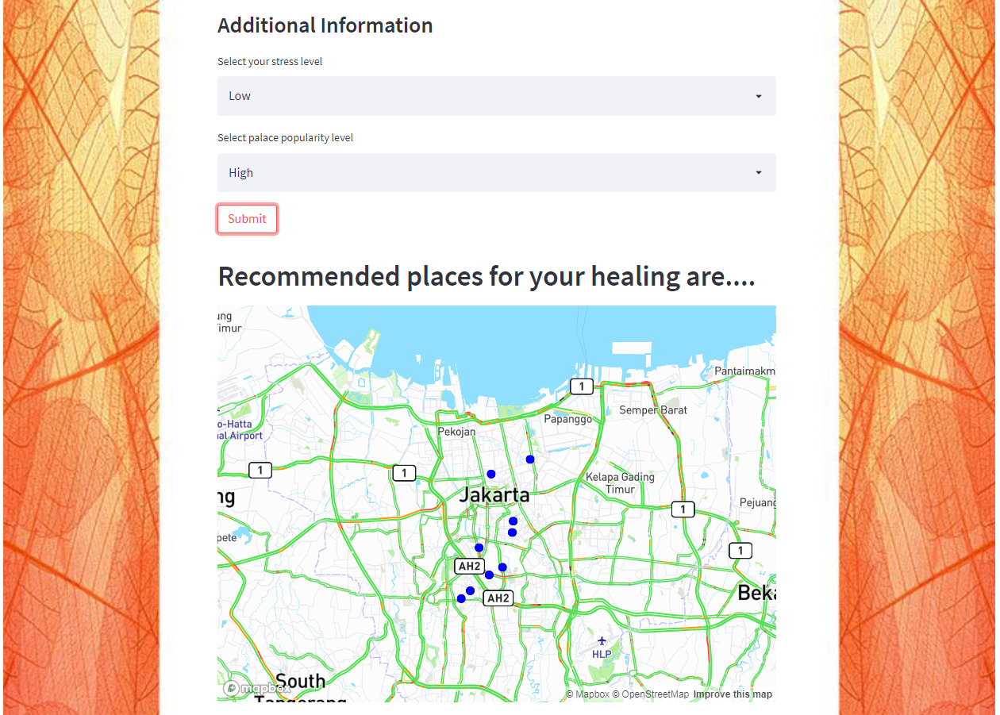
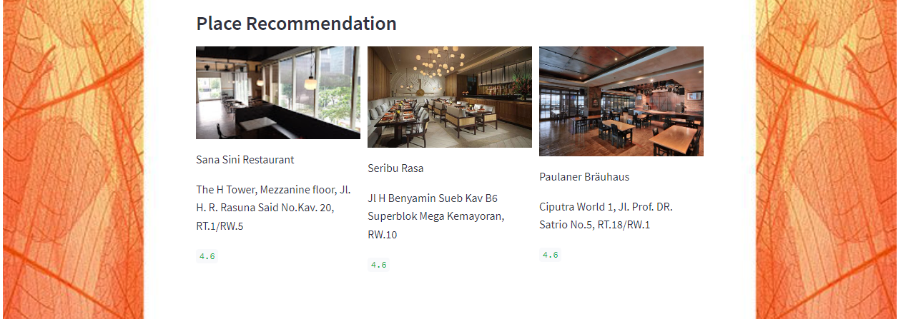
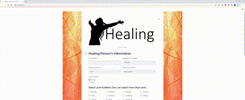
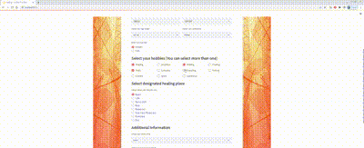
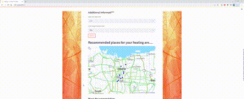
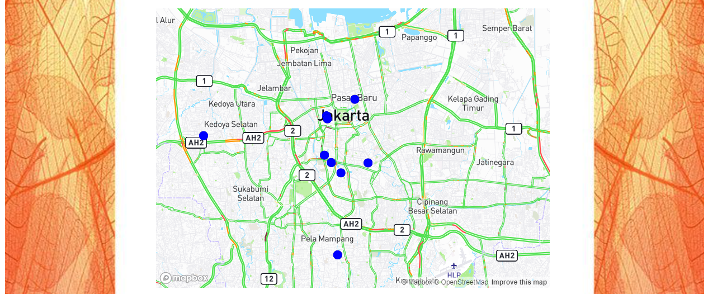

# Hi there, Welcome to ours Final Projects!

## About the projects:

**Healing Project**

Healing project
Healing Project adalah sebuah sistem rekomendasi  khususnya untuk daerah Jakarta yang dapat memberikan rekomendasi tempat healing berdasarkan hobi yang yang dimiliki oleh pengguna serta preferensi tempat berdasarkan tingkat kepopuleran tempatnya.

# Deployment : 

We deploy the application through Heroku, and please don't hesitate to try the application and give us your feedback!

- [Heroku](https://healing-fp-ftds12-g4.herokuapp.com/)
- [Feedback](https://forms.gle/KTWkL3hft8odWD3i9)

Some screenshot of Healing Application:

**Preview of the apps:**

<!-- **Preview App** -->
<!-- input personal information & hobbies

select place & additional information

and done
 -->

**Interactive Map**

## Meet the team!

**Hacktiv8 - Group 4 - Batch 12**

- Muhammad Irham Dinan

[Linkedin](https://www.linkedin.com/in/dinanirham/)
&nbsp;&nbsp;
[Github](github.com/dinanirham)

- Malvin Subahri

[Linkedin](https://www.linkedin.com/in/malvinsubahri/)
&nbsp;&nbsp;
[Github](https://github.com/Malvinsubahri)

- Gusti Ayu Dewi Puspa Kartikasari

[Linkedin](https://www.linkedin.com/in/gusti-ayu-dewi-puspa-k/)
&nbsp;&nbsp;
[Github](https://github.com/DepusBuana)